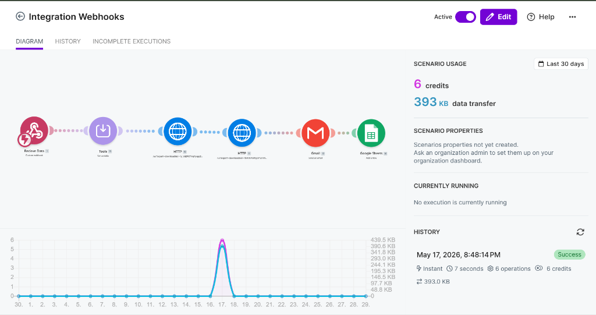
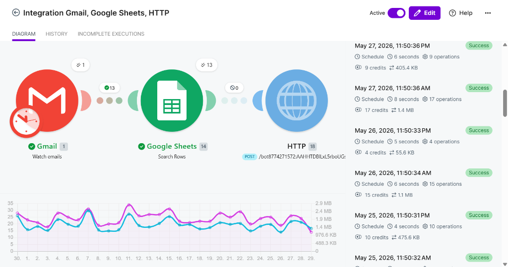

Automated Email Referral & HR Reply Tracker System

A real-world automation system built to solve two practical problems faced during job search outreach - built with zero manual intervention and zero extra cost.

Overview

This project consists of two automation workflows designed and built independently to streamline the job referral outreach process:

Automated Email Referral Workflow - Sends personalized referral request emails with attachments automatically
HR Reply Tracker - Monitors Gmail for HR replies and sends real-time Telegram notifications instantly

Both were born out of real frustrations during daily job search outreach - and solved by shipping working automation systems.

⚡ Workflow 1 - Automated Email Referral System

Problem
Sending 10+ personalized referral emails daily with Resume and LOR attachments was repetitive, time-consuming, and error-prone.

✅ Solution
A webhook-triggered automation pipeline that:

Accepts recipient details via a Webhook
Dynamically personalizes the email (Name, Role, Company)
Attaches Resume and Letter of Recommendation automatically
Dispatches the email via Gmail integration

🔧 Tech Stack
ToolPurposeMake (Integromat)Automation platformWebhooksInput triggerGmail IntegrationEmail deliveryHTTP ModulesAPI communicationGoogle DriveFile retrieval (Resume + LOR)

Workflow Diagram
Webhook Trigger
      ↓
Data Processing (Name, Role, Company)
      ↓
File Retrieval (Resume + LOR from Drive)
      ↓
Email Personalization
      ↓
Gmail Dispatch ✅

🌟 Key Highlights

✅ Zero manual effort after setup
✅ Dynamic personalization per recipient
✅ Automatic attachment handling
✅ Scalable to any number of recipients
✅ Professional and structured email format every time

📊 Workflow 2 - HR Reply Tracker (Zero Cost)
🎯 Problem
When sending referral emails at scale, tracking which HRs replied became chaotic. Gmail groups replies into threads, forcing manual scrolling through hundreds of conversations - slow, confusing, and error-prone.

✅ Solution
An automated reply monitoring system that:

Monitors incoming Gmail for new emails
Cross-checks sender against a Google Sheets contact list
Filters out bots, no-reply, and system-generated emails
Fires an instant Telegram notification when a real HR replies

Tech Stack
ToolPurposeMake (Integromat)Automation platformGmail IntegrationEmail monitoringGoogle SheetsContact list storageHTTP ModuleAPI requestsTelegram Bot (BotFather)Real-time notifications

Workflow Diagram
Gmail - New Email Received
      ↓
Check Sender vs Google Sheets Contact List
      ↓
Filter: Is it a real HR? (Remove no-reply/bots)
      ↓
Match Found?
      ↓
Telegram Notification Triggered ✅
"HR replied: hr@company.com"

As telegram give bot as free using BotFather i have created seperated Bot for notification triggering mechaniscm.

🌟 Key Highlights

✅ Real-time notifications - zero delay
✅ No missed replies
✅ Noise filtered - only real HR replies trigger alerts
✅ Cost: ₹0 - built entirely with free tools
✅ Scalable for large-scale outreach

 Why I Built This
Both projects weren't assignments or tutorials.
They were real problems I faced during my own job search - and I solved them by building and shipping working solutions.

"I didn't wait for the perfect resume. I built something instead."

About Me
Vivek Kotha
Final-year B.Tech Student | CSE (AI & ML)
CMR College of Engineering & Technology, Hyderabad
💼 Experience

🔹 Backend Developer Intern - Evangelion Solutions (Jan 2026 - Mar 2026)
🔹 Backend Intern Trainee - SyntecxHub (Dec 2025 - Jan 2026)

Tech Stack

Frontend: React, JavaScript (ES6+), HTML5, CSS3
Backend: Node.js, Express.js, RESTful APIs, EJS
Databases: MongoDB, Firebase Firestore, SQL
Tools: Git, Postman, VS Code, Make (Integromat)

📫 Contact

📧 kothavivek55@gmail.com
📱 +91-8074530982
 linkedin.com/in/vivekkotha/
