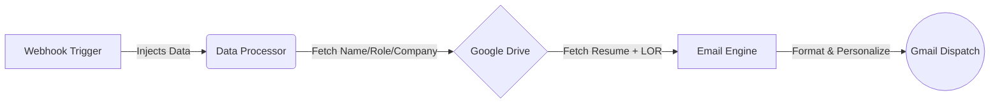
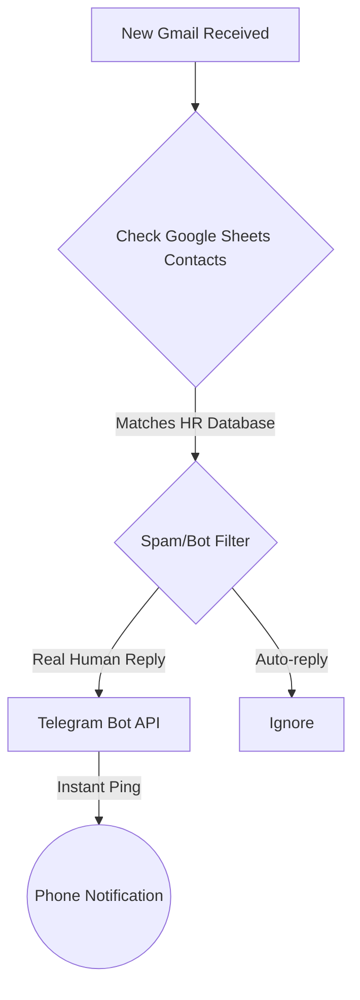

  <h1>🚀 Automated Email Outreach & HR Reply Tracker</h1>
  
<b>A zero-cost, fully automated job application pipeline built to eliminate manual outreach and track recruiter replies in real-time.</b>

  
  
  
  

---

## 🎯 The Vision
This project wasn't built as an assignment or tutorial. It was born out of a real-world frustration: **Sending 10+ personalized referral emails daily with Resume and LOR attachments is tedious, slow, and error-prone.** 

Instead of waiting for the perfect resume, I built a zero-cost automation ecosystem to do the heavy lifting for me. 

---

## ⚡ Workflow 1: Automated Email Referral System

### ❌ The Problem
Manually drafting emails, attaching resumes/LORs from Google Drive, and personalizing the Name, Role, and Company for every recruiter took hours.

### ✅ The Solution
A webhook-triggered automation pipeline that scales to infinite recipients instantly.

**Key Features:**
*   **Zero Manual Effort:** Once the webhook receives data, the rest is autonomous.
*   **Dynamic Personalization:** Every email is uniquely tailored to the recipient.
*   **Smart Attachments:** Automatically pulls the latest Resume and Letter of Recommendation.

 

  

---

## 📊 Workflow 2: Real-time HR Reply Tracker

### ❌ The Problem
When sending hundreds of cold emails, Gmail groups replies into messy threads. Searching through endless conversations to find actual HR replies is chaotic and risks missing interview opportunities.

### ✅ The Solution
A highly intelligent filtering system that watches the inbox, filters out auto-replies, and pings my phone via Telegram the exact second a real human recruiter replies.

**Key Features:**
*   **Zero Delay:** Instant Telegram push notification via BotFather.
*   **Noise Filtering:** Actively ignores 'no-reply' emails, bots, and system alerts.
*   **Zero Cost:** Built entirely using free-tier tools and APIs.

 

  

---

## 🛠️ Tech Stack & Integrations

| Technology | Purpose |
| :--- | :--- |
| **Make (Integromat)** | Visual automation platform orchestrating the logic |
| **Webhooks / HTTP** | API communication & data injection triggers |
| **Gmail API** | Inbox monitoring and automated dispatching |
| **Google Drive** | Secure cloud retrieval for attachments |
| **Google Sheets** | Database for contact matching & verification |
| **Telegram API** | BotFather integration for real-time mobile push notifications |

---

## 👨‍💻 About The Developer

> *"I didn't wait for the perfect resume. I built something instead."*

**Vivek Kotha**  
*Final-year B.Tech Student | CSE (AI & ML) @ CMR College of Engineering & Technology*

**💼 Experience**
*   **Backend Developer Intern** - Evangelion Solutions (Jan 2026 - Mar 2026)
*   **Backend Intern Trainee** - SyntecxHub (Dec 2025 - Jan 2026)

**💻 Core Skills**
*   **Frontend:** React, JavaScript (ES6+), HTML5, CSS3
*   **Backend:** Node.js, Express.js, RESTful APIs, EJS
*   **Databases:** MongoDB, Firebase Firestore, SQL

  
  

